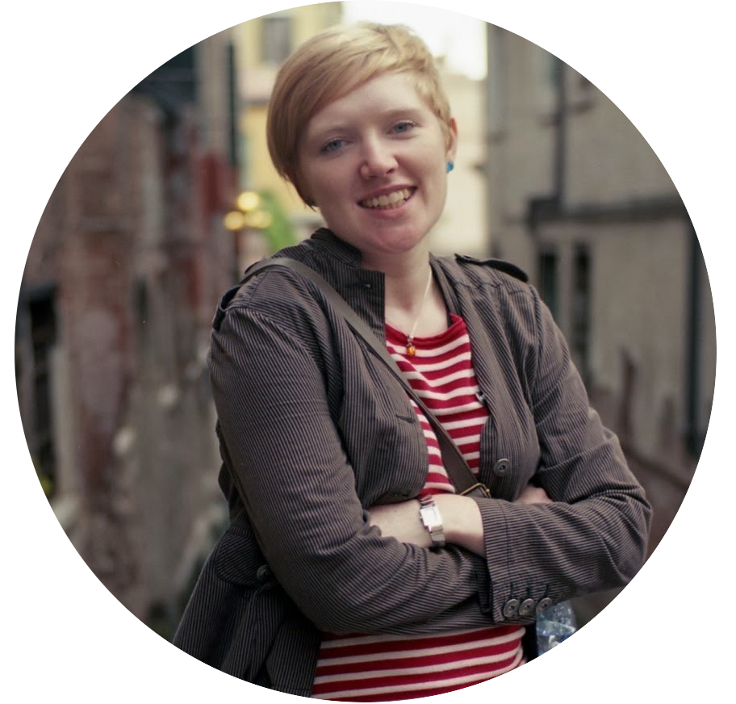

# 
 Gráinne  &nbsp;   Costigan 

  

 <b> Gráinne </b> is pronounced <i> Gronya </i>. One of many Irish names that do not travel very well.

My collection of degrees include a BAmod(Science) in Theoretical Physics (Trinity College Dublin), a masters in mathematics (Uni. of Cambridge) and a PhD in astronomy (Queen's Uni. Belfast, with ESO (Munich), DIAS (Dublin), Armagh Observatory (N. Ireland)). I have postdoc In Leiden Observatory (NL) in the Gaia data processing consortium, teaching experience in Colombia (see <a href="../communications">Communication</a>) and for a time I was city Astronomer in Dundee (Scotland). 

